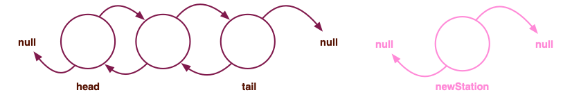
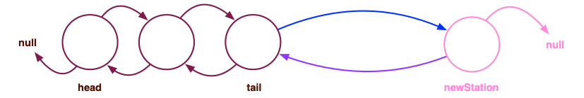
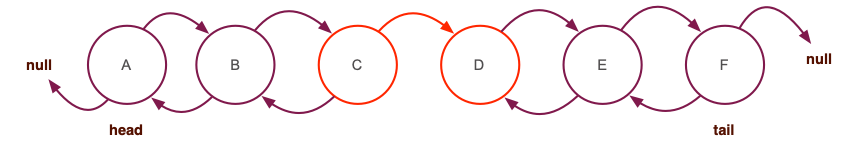

# Grading notes for assignment 06

Class `TrainLineBidirectional` is the complete solution based on the advanced analysis below.

## Analysis 

This problem needs to be solved first on paper. 

Consider an existing, bidirectional trainline (the technical name is "doubly linked list"), as shown below. The train line is well defined with `head` and `tail` stations marking its front and back. Now we with to add another station to it.



After we create the new station object we have to make the necessary connections.





 The new station should be after the current `tail` station:
 ```java
 this.tail.setNext(newStation); 
 ```

 The new station must point back to the current `tail`:
 ```java
 newStation.setPrev(this.tail);
 ```

And finally, the new station becomes the tail station for the train line:


 ```java
 this.tail = newStation;
 ```

 So really, we need just one extra line in `TrainLine.addStation(Station)` method to work with stations pointing to the `next` and `prev` objects. That's the line where we assign a value to the new station's `prev` pointer:


 ```java
 newStation.setPrev(this.tail);
 ```

 **The challenge** is now to tell the `addStation` method whether we are building a uni- or bi-directional line? 

 Impulsively we may consider adding a boolean parameter to the method like so:

 ```java
 public void addStation(Station station, boolean biDirectional)
 ```

 and then use an if statement when adding a new station to the end of the line:


 ```java
if (biDirectional) {
     newStation.setPrev(this.tail);
} // new code
this.tail.setNext(newStation); // same as before
this.tail = newStation; // same as before
 ```

This may work, but unless we are very careful, a user may write code like this:

```java
TrainLine tl = new TrainLine();
td.addStation("A", true);
td.addStation("B", true);
td.addStation("C", true);
td.addStation("D", false); // Hmmm....
td.addStation("E", true);
td.addStation("F", true);
```

And the result will be the following `TrainLine` object.



Now, you (as the developer) may have a reason to allow such train lines. Or may not. If you wish to allow such objects, you need to document the need. In the absence of such need, however, a train line must be either unidirectional or bidirectional; we cannot have both.

## Advanced analysis 

To ensure consistency in directionality, we need to change the design of the `TrainLine` object a bit. Specifically, add one more *object field* to determine if this is a unidirectional or a bidirectional line. This will necessitate a default direction preference for the object (I chose unidirectional) and the addition of a *basic* constructor to allow choice of directionality. The relevant code is shown below.

```java
public class TrainLine {
    ...
    private boolean biDirectional;
    private static final boolean BIDIRECTIONAL = false;

    /** Basic constructor allows choice of directionality */
    public TrainLineBidirectionalSolution(boolean biDirectional) {
        this.head = null;
        this.tail = null;
        this.numberOfStations = 0;
        this.biDirectional = biDirectional;
    } // basic constructor

    /** Default constructor */
        public TrainLineBidirectionalSolution() {
        this(BIDIRECTIONAL);
    } // default constructor
    ...
} // class TrainLine
```

The `addStation` method keeps its original signature and uses an if-statement, as done earlier in the discussion here, to connect the `prev` field when the object is bidirectional (code shown with minimal comments for brevity):

```java
public void addStation(Station station) {
    if (this.head == null) {
        this.head = station;
        this.tail = station;
    } else {
        if (this.biDirectional) { // connect prev to tail
            station.setPrev(this.tail);
        }
        this.tail.setNext(station); 
        this.tail = station; 
    }
    this.numberOfStations++;
} // method addStation
```

## How to evaluate yourself

Your analysis should have led you to modify method `addStation` to allow bidirectional connections.

Maybe you wrote a separate method, for example, `addStationBiDirectional` for train lines whose stations used both `prev` and `next`. And you kept the original `addStation` method for unidirectional objects. That's fine too but you should have noticed that the code between the two methods is very similar and you should have tried to mitigate the issue.

Your code is compliant with the **Programmers' Pact.**

You were not asked (nor expected) to carry the problem analysis further, making directionality a property of the `TrainLine` object itself instead of an option for the `addStation` method. The advanced analysis earlier is for discussion purposes.
