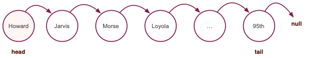
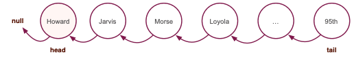
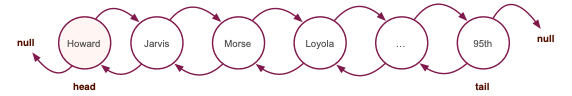

# Assignment 6

As with *every assignment* in this course, you cannot import anything to your code. Furthermore, you cannot use any `System` function except for `System.out` print statements where and when needed. Finally, your code should not use any `for`-loops.

Your code must be compliant with the Programmers Pact, as much as possible.


## Modify TrainLine for bidirectional routes

Class `Station` has been modified to allow station objects pointing to a downstream (`next`) station and an upstream station (`prev`).

How would you modify the `addStation` method in `TrainLine` to accomodate bidirectional routes?

Notice that there `addStation` is an overloaded method with headers:

```java
void addStation(String name)
```

and

```java
void addStation(Station station)
```

The heavy lifting is done by `addStation(Station)` now.

Your modifications should allow the construction of both bidirectional and unidirectional routes, as shown in the figures below.

Unidirectional route from left to right (employing only `Station.next` pointers):




Unidirectional route from right to left (employing only `Station.prev` pointers):




Bidirectional route (employing both `Station.next` and `Station.prev` pointers):



Notice that in the two unidirectional objects above, each station has still two pointers -- the ones that are `null` are omitted. For example, in the unidirectional route from Howard to 95th, each station has a `prev` pointer; because they are all `null` they are ommitted from the picture, for simplicity.