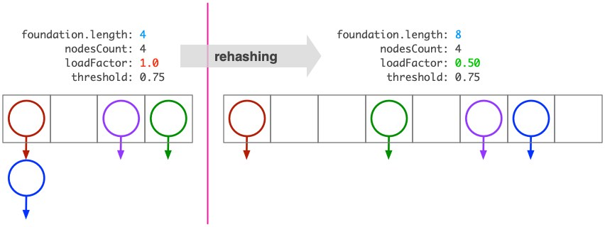

# Grading notes for assignment 9


Modifying `Hash271` to maintain a load factor at or below a user-specified threshold requires two major changes. First we need to add some new fields and constants, and then we have to build the *rehashing* mechanism.

## New fields

### `int nodesCount`

This is a plain counter that increments by 1 every time we add a new `Node` to one of the linked lists in array `foundation`. The counter is needed because the load factor for the hash structure is defined as the ratio of nodes to the length of `foundation`.

### `double loadFactor`

This is a computed field that is updated every time we add a node and increment `nodesCount`. The field is updated as
```java
this.loadFactor = (double) this.nodesCount / (double) this.foundation.length;
```


### `double threshold`

This field helps us determine when to rehash the structure. At some point, we should have a conditional statement like:
```java
if (this.loadFactor > this.threshold)
  this.rehash();
```
Where this statement belongs, we'll see in a bit.


### `final int DEFAULT_THRESHOLD = 0.75`

This becomes the default value for `threshold` unless the user specifies a different one through a constructor or a mutator.


## Methods


### Changes in `void put`

After we place a `Node` in one of the spots in `this.foundation`, we update the count of nodes and the load factor. Then we check if the load factor exceeded the specified threshold, and if so, we rehash:

```java
this.nodesCount++;
this.loadFactor = (double) nodesCount / (double) this.foundation.length;
if (this.loadFactor > this.threshold)
  this.rehash();
```

I am often asked why I use two casts
```java
(double) nodesCount / (double) this.foundation.length;
```

when either

```java
nodesCount / (double) this.foundation.length;
```

or 

```java
(double) nodesCount / this.foundation.length;
```

would suffice. I do so to communicate intention and purpose. By using casts on both variables, I hope to communicate to other programmers that, yes, I know `nodesCount` and `foundation.length` are integers. 


### `private void rehash()`

The idea here is to move the nodes in the linked-list array `this.foundation` to a larger array of linked lists. The situation is illustrated in the figure below. We create a hash structure with `threshold = 0.75` and we keep adding nodes to it, until the structures `loadFactor` exceeds that threshold.

 

When `loadFactor > threshold`, we create a larger array, place the existing nodes there, and effectively we reduce the load factor to a level below the specified threshold. If we are not careful about node placement, we may end up with a larger underlying array but with a totally inefficient arrangement as shown below.


The careful placement of nodes in the array of linked lists depends on our choice for a hash code. For this assigment, class `Node` was programmed with a *simplistic* `int hashCode` method to return the ASCII code of the first symbol of the string `Node.data`. Such simple hash codes will inevitably lead to inefficient structures. For now, they are sufficient to demonstrate the concept of hashing.

Rehashing the structure involves the following basic steps:
* Create a larger array of linked lists.
* Copy each node from the smaller array into the larger array, using the same strategy to determine the nodes' position in the new array as used in the old array.
* Replace the old array with the new array.
* Update the load factor now that the `foundation` array is larger.


#### Create a larger array

This is straight forward, and we have done similar things when we were programming dynamic arrays.

```java
Node[] temp = new Node[this.foundation.length*2];
```

Of course we can't just multiply by 2 as shown above. We need to introduce either a constant or an object attribute to determine the resizing factor. In my solution, I use a constant, `RESIZE_BY=2;`.


#### Copy each node

Copying each node in the linked lists of `this.foundation` to `temp` is straight-forward:

```text
for every linked list in this.foundation:
  for every node in that linked list:
    copy the node and place it in the temp array
```

We can traverse the array `this.foundation` with a plain or enhanced for-loop, and then traverse each linked list in the array just like any other linked list

```java
for (int i = 0; i < this.foundation.length; i++) {
  Node currentListHead = this.foundation[i];
  Node current = currentListHead;
  while (current != null) {
    // copy current node and place it in temp array
    current = current.getNext();
  }
}
```

We need to be careful how to copy the `current` node. A rookie mistake we make early in our training is to write

```java
Node newNode = current; // copy of current node
```

This creates a *shallow copy,* i.e., a copy of the object's reference, not a copy of its contents. A shallow copy is not an independent copy. We want a *deep copy* which can be accomplished by creating a new node that has the same contents as `current`:

```java
Node newNode = new Node(current.getData());
```

Now we can compute the hash code of the new node and place it accordingly in the new array. The full code is given below.


#### Full code

In my solution I use an enhanced-for loop but otherwise the implementation is as described earlier.

```java
private void rehash() {
  Node[] temp = new Node[RESIZE_BY*this.foundation.length];
  for (Node node: this.foundation) {
    Node current = node;
    while (current != null) {
      Node newNode = new Node(current.getData());
      int destination = newNode.hashCode() % temp.length;
      if (temp[destination] != null) {
        newNode.setNext(temp[destination]);
      }
      temp[destination] = newNode;
      current = current.getNext();
    }
  }
  this.foundation = temp;
  this.loadFactor = (double) nodesCount / (double) temp.length;
} 
```


## The quality of hash code 

This part is beyond the scope of the assignment, but it's a very important topic.

The `Node` objects in the earlier exampe have a hash code function that returns the ASCII code of the first letter in `Node.data` or 0 if the string is empty or null. Assuming that we store just names in the nodes. There will be 26 different hash codes (each name starts with an upper case letter).

Now consider that initially, array `foundation` has only 4 elements. Every name that starts with the letter `A`, will be hashed in `foundation[1]`, because `65%4=1`. Same for every name that starts with a `U`, because the ASCII value of `U` is 85 and `85%4=1`. At some point, the load factor of the structure will exceed the specified threshold, and the size of array `foundation` will increase; let's say it will double. 

Now, every name that begins with 'A' will be hashed in `foundation[1]` but every name that starts with a `U` will be hased at `foundation[5]`. There are far more names starting with an A than a U. As we keep adding names to the data structure, using the first letter as the hash code, we'll end up with a very large array `foundation` that has a lot of names in a very few places.

Imagine that we store 990 names starting with A and 2 names starting with U. There will be 1000 nodes in the data structure. To maintain a load factor below 75% we will need an array with 2048 elements. But only two positions in this array will be occupied. Specifically `foundation[65]` will contain a linked list with 998 nodes (the names starting with A) and `foundation[85]` will contain a linked list with 2 nodes (the names starting with U). The remainining 2046 positions in the array will be empty. And not only that. Searching for a name starting with an A, may take up to 998 look-ups. There goes our promise to make this an efficient search structure.

The **root of the problem** is the simple hash code we programmed in `Node`:

```java
public int hashCode() {
  return (this.data != null && this.data.length() > 0) ? (int) this.data.charAt(0) : 0;
}
```

For a non-empty string, the function returns `(int) this.data.charAt(0)`, i.e., the `int` value of the first character in `this.data`; practically, the ASCII value of that character. For upper case letters, A-Z, that's a value in the range [65, 90].

Now, consider that we changed the hash code slightly and for a non-empty string we returned

```java
(int) this.data.charAt(0) + (int) this.data.chartAt(1);
```

which is the sum of the ASCII values of the first two letters in `this.data` (assuming now that `this.data.length()>1`). The range of values is now from 130 (for `"AA"`) to 180 (for `"ZZ"`). That's 51 different hash codes, compared to the 26 we had when we used just the firt letter earlier. All the names that start with `A` will not be hashed in the same position of `this.foundation`.

**An arithmetically richer hash code reduces the probability of collisions** in array `this.foundation`.

In Java, class `String` defines the hash code for each string as a binary power series.

$$s[0]\cdot 31^{n-1} + s[1]\cdot 31^{n-2}+\ldots s[n-1]\cdot 31^0$$


In the formula above, $s[i]$ is the $i$-th character of the string, and $n$ is the length of the string. (Source: Java String Class). For example, the hash code for string `"ABC"` will be:

$$
65\cdot 31^2 + 66\cdot 31^1 + 67\cdot 31^0 = 64578
$$

This technique has a limitation. `int` primitives in Java can be in the range -2147483648 to 2147483647, i.e., $-2^{31}$ to $2^{31}-1$. Let's say, for simplicity, that the larger positive `int` is $2^{31}$. The `String` hash code uses powers of 31. That's almost 32 which can be written as $2^5$. So a string with five characters will have a hash code approximately equal to

$$
s[0]\cdot (2^5)^4 + s[1]\cdot (2^5)^3 + ...  =  s[0]\cdot 2^{20} + s[1]\cdot 2^{15} + ...
$$

This gets us pretty close to the edge of `int` ranges. A string with six characters will have a hash sum that starts with $s[0]\cdot 2^{25}$. That's *only* 64 times less than the maximum value. So strings with 6 or more characters can cause an *arithmetic overflow*. For example,

```java
"airport".hashCode() // returns -991666997
```

*That's ok!* As long as we anticipate the overflow, we can handle it. For example, when hashing a string using its built-in `hashcode`, we can correct negative values first, like so:

```java
int hashCode = ourString.hashCode();
if (hashCode < 0)
  hashCode = -hashCode;
```

Here're some statistics about good and bad hash functions.

As writen, `Node.hashCode()` is a bad function; it returns the ASCII code of just the first letter in the string `Node.data`.

As mentioned above, if we have 1000 nodes, we'll need a `foundation` array with size about 1300 to maintain a 75% load factor. If 998 of these nodes contain a `data` string that begins with an `A` and the other two strings that begin with a `C`, we'll have linked lists in two positions of the array only. Specifically `this.foundation[65]` will have a linked list with 998 nodes (all nodes with `A`s) and `this.foundation[67]` will have a linked list with two nodes.


# Julienne Walker's *The Art of Hashing*

  *The following material is from Julienne Walker's notes on *The Art of Hashing* © 2015. As far as I understand it, the book was published online on a now defunct website called *Eternally Confuzzled*. I managed to recover the following text on hashing, from the Internet Archive, and I publish it here under the *fair use* doctrine. The code in Walker's note is in C and fairly accessible even if you don't know the language. As I continue to research Walker's work, I will update the source and citation data here.* <br/>- Leo Irakliotis, July 2024.

In Binary Search Trees I, and II, we considered methods for efficient searching of an ordered collection by using key comparisons. While these methods were indeed very fast, they were limited to O(log N) performance due to the comparison tree inherent in the data structure. Binary search trees are also somewhat complicated, especially when the chance of encountering a degenerate tree is minimized, or removed entirely.
An alternative method for searching uses they key itself an an address into the data structure, thus breaking the O(log N) barrier and allowing searches to be performed with an expected time complexity of O(1), which is as good as it gets when it comes to searching, and algorithms in general.

Unfortunately, not all keys are easily used as a table address. Strings, for example, are not suitable, because array subscripting requires an integer. Even when using integers, if the value is outside of the range of the array, using it as an index will cause an out of bounds access. Hashing is the solution to this problem.
The simplest case when it comes to converting a key into a table address is when you have an integer key. In that case it is a simple matter of forcing the integer into the range of the table, most commonly with the remainder operator:

```C
unsigned index = key % N;
```

Unfortunately, this is insufficient most of the time for two reasons. First, keys are more likely to be strings than integers. There has to be some way to convert a string into a table address, or hashing would die a quick death. Second, by forcing the integer into a smaller range, there is a good chance that unique keys will have the same table address after the conversion. This is called a collision, and collisions are the bane of hash function designers.

Hashing a string into a table address is more complicated because instead of a single numeric value there are several, and a good hash function should take them all into account when constructing a table address. Fortunately, hashing strings can be generalized into hashing a sequence of memory blocks, so it is possible to avoid having to develop a different hash function for different key types. The rest of this tutorial will assume that this generalization has been made and we will look at several general hash functions.

Uses for hashing

By far, the most well known use for hashing is to convert a key into an array index for table lookup. Such data structures are called hash tables, and they are incredibly useful for a wide range of fields. For example, in a compiler, a hash table will likely be used for keyword and identifier storage because a compiler needs quick access to this information. A compiler may (should!) also use a hash table for optimizing switch statements, and a number of other purposes. A hash table is also surprisingly well suited to the implementation of a cache, and many web browsers and operating systems will use a hash table for just that.

Probably the second most well known use for hashing is in cryptography, where algorithms that are geared more toward security are used to create digital fingerpints for authentication and data integrity. While lookup hashes are not as complicated or as powerful as cryptographic hashes, adherence to many of the design principles for a cryptographic hash will typically result in a very good lookup hash, so even though there is a clear distinction between hashing for lookup and hashing for cryptography, one can encourage improvement in the other.

This tutorial will focus on hashing for lookup.

Pigeonhole Principle

When hashing a key so that it can be used as an array index, it should be immediately obvious that the size of the array should be at least as large as the input collection. This observation is simple, and some might think that it goes without saying, but it is actually a specialization of the Pigeonhole Principle, where if M items are placed in N buckets, and M is greater than N, one or more buckets contain two or more items. This is one of the two principles that pave the way toward understanding collisions.
A collision is when two keys hash to the same index. The pigeonhole principle proves that no hashing algorithm can hash every key to a unique index if the possible keys exceeds the size of the array. Since most uses of hashing for lookup involve trying to take keys in a broad range and force them into indices for a smaller range, it stands to reason that no hash algorithm can perfectly hash a sequence of unknown keys into unique indices.

Perfect hashing

After having told you that collisions are a necessary evil, and dashing your hopes that there could be a “perfect” hash function, I will now contradict myself and say that there is such a thing as perfect hashing! However, despite the existence of perfect hash algorithms, they are dreadfully difficult to discover for all but the smallest inputs where the number of keys and the exact construction of every possible key is known. As such, while a perfect hash algorithm exists for every input, it is unreasonable to expect that it can be found, so instead of searching for a perfect hash function, it is better to simply build a hash function that minimizes collisions instead of denying them completely.

Constructing a perfect hash

A perfect hash can be created if the number and construction of the keys are known factors. For example, a perfect hash for a list of ten product numbers that are sure to differ in their 4th and 5th digits can be easily constructed:
unsigned hash(unsigned pid)

```C
{
    return pid / 1000 % 100;
}
```

However, notice that even though there are only ten product numbers, a table of 100 buckets must be created because the resulting hash values are at least two digits. This is a terrible waste of space, but if the range is forced into an array of 10 buckets, the right digit of the hash values may cause a collision. In such a case, the pigeonhole principle applies, and we can no longer guarantee that this hash algorithm is perfect.

Minimal perfect hashing

A minimal perfect hash algorithm maps every key to every bucket, without any unused buckets. Unlike the perfect hash function above, a minimal perfect hash function would not have any collisions when hashing the 4th and 5th digits of the product numbers and placing the result in an array of 10 buckets. Discovering this function is considerably more difficult, and we are still only dealing with two digit numbers.

A minimal perfect hash algorithm can only be found manually with a great deal of work, or in exceptionally simple cases. For example, hashing ten single digit integers into an array with 10 buckets is trivial, but by adding another digit to the integers, the problem becomes much harder. In general, a minimal perfect hash function can only be found through an exhaustive search of the possibilities.

Algorithms have been devised that will exhaustively search for perfect and minimal perfect hash functions. If one is needed then these tools will be a much better option than trying to discover an algorithm manually. Many of these tools are freely available on the web.

Properties of an ideal hash

With the understanding that collisions will be inevitable in all but the most specialized of cases, a primary goal in developing a hash function for lookup is to minimize collisions. This typically means forcing a uniform distribution of the hash value, much like a random number generator. However, unlike a random number generator, the process must be repeatable so that the same key hashes to the same index, while different keys do not. This goal can be broken down into two general properties of an ideal hash.

An ideal hash will permute its internal state such that every resulting hash value has exactly one input that will produce it. Any hash function that uses every part of the key to calculate the hash value will typically meet this requirement, so general hash functions that only process a part of the key will almost always be very poor because the differing parts of the key may not be the parts involved in creating the hash value. A good example of this is only hashing the first four or five characters of a string, and then using the algorithm to hash URLs that start with `http://`.

A hash function is said to achieve avalanche if the resulting hash value is wildly different if even a single bit is different in the key. This effect aids distribution because similar keys will not have similar hash values. A hash function that distributes the hash values in a uniform manner will minimize collisions and fill the array more evenly. Avalanche is a concept derived from cryptographic hashing, and it offers a way to ensure that a hash function is good when used for table lookup.
Often you will see hash functions that claim to be "best for strings" or “best for integers”. These functions should be avoided because if a hash function is not good for all types of data then it is probably a poor algorithm in general. Sometimes, on the other hand, a hash function may be optimized for a single type for performance reasons. It is good to learn to tell the difference between the two, but a safe practice is to only use general hash functions that are known to be good. This tutorial offers several examples of good general hash functions.


Using existing hash functions

Designing a hash function is a black art. As such, it is always better to use a known good algorithm than to try and invent one. Hash functions are similar to random number generators in many ways, and just as with random number generators, it is easier to design a very poor hash function than to design even a mediocre one. This tutorial will describe several good hash functions so that you can avoid the temptation to write an ad hoc algorithm when the time comes. We will also look at a few not so good hash functions so that you will be able to recognize them in the real world.

Additive hash

Probably the simplest algorithm for hashing a sequence of integral values (such as a string), is to add all of the characters together and then force the range into something suitable for lookup with the remainder of division. I will give an example of this algorithm only because books commonly suggest it in their rush to get past the topic of hash functions on their way to collision resolution methods. This algorithm is very bad:

```C
unsigned add_hash(void *key, int len)
{
    unsigned char *p = key;
    unsigned h = 0;
    int i;

    for (i = 0; i < len; i++)
    {
        h += p[i];
    }

    return h;
}
```

Generally, any hash algorithm that relies primarily on a commutitive operation will have an exceptionally bad distribution. This hash fails to treat permutations differently, so “abc”, “cba”, and “cab” will all result in the same hash value.
Despite the suckiness of this algorithm, the example is useful in that it shows how to create a general hash function. add_hash can be used to hash strings, single integers, single floating-point values, arrays of scalar values, and just about anything else you can think of because it is always legal to pun a simple object into an array of unsigned char and work with the individual bytes of the object.

XOR hash

The XOR hash is another algorithm commonly suggested by textbooks. Instead of adding together the bytes of an object as the additive hash does, the XOR hash repeatedly folds the bytes together to produce a seemingly random hash value:


```C
unsigned xor_hash(void *key, int len)
{
    unsigned char *p = key;
    unsigned h = 0;
    int i;

    for (i = 0; i < len; i++)
    {
        h ^= p[i];
    }

    return h;
}
```

Unfortunately, this algorithm is too simple to work properly on most input data. The internal state, the variable h, is not mixed nearly enough to come close to achieving avalanche, nor is a single XOR effective at permuting the internal state, so the resulting distribution, while better than the additive and multiplicative hashes, is still not very good.

Rotating hash


```C
unsigned rot_hash(void *key, int len)
{
    unsigned char *p = key;
    unsigned h = 0;
    int i;

    for (i = 0; i < len; i++)
    {
        h = (h << 4) ^ (h >> 28) ^ p[i];
    }

    return h;
}
```

The rotating hash is identical to the XOR hash except instead of simply folding each byte of the input into the internal state, it also performs a fold of the internal state before combining it with the each byte of the input. This extra mixing step is enough to give the rotating hash a much better distribution. Much of the time, the rotating hash is sufficient, and can be considered the minimal acceptable algorithm. Notice that with each improvement, the internal state is being mixed up more and more. This is a key element in a good hash function.

Bernstein hash

Dan Bernstein created this algorithm and posted it in a newsgroup. It is known by many as the Chris Torek hash because Chris went a long way toward popularizing it. Since then it has been used successfully by many, but despite that the algorithm itself is not very sound when it comes to avalanche and permutation of the internal state. It has proven very good for small character keys, where it can outperform algorithms that result in a more random distribution:


```C
unsigned djb_hash(void *key, int len)
{
    unsigned char *p = key;
    unsigned h = 0;
    int i;

    for (i = 0; i < len; i++)
    {
        h = 33 * h + p[i];
    }

    return h;
}
```

Bernstein's hash should be used with caution. It performs very well in practice, for no apparently known reasons (much like how the constant 33 does better than more logical constants for no apparent reason), but in theory it is not up to snuff. Always test this function with sample data for every application to ensure that it does not encounter a degenerate case and cause excessive collisions.

Modified Bernstein

A minor update to Bernstein's hash replaces addition with XOR for the combining step. This change does not appear to be well known or often used, the original algorithm is still recommended by nearly everyone, but the new algorithm typically results in a better distribution:


```C
unsigned djb_hash(void *key, int len)
{
    unsigned char *p = key;
    unsigned h = 0;
    int i;

    for (i = 0; i < len; i++)
    {
        h = 33 * h ^ p[i];
    }

    return h;
}
```

Shift-Add-XOR hash

The shift-add-XOR hash was designed as a string hashing function, but because it is so effective, it works for any data as well with similar efficiency. The algorithm is surprisingly similar to the rotating hash except a different choice of constants for the rotation is used, and addition is a preferred operation for mixing. All in all, this is a surprisingly powerful and flexible hash. Like many effective hashes, it will fail tests for avalanche, but that does not seem to affect its performance in practice.


```C
unsigned sax_hash(void *key, int len)
{
    unsigned char *p = key;
    unsigned h = 0;
    int i;

    for (i = 0; i < len; i++)
    {
        h ^= (h << 5) + (h >> 2) + p[i];
    }

    return h;
}
```

FNV hash

The FNV hash, short for Fowler/Noll/Vo in honor of the creators, is a very powerful algorithm that, not surprisingly, follows the same lines as Bernstein's modified hash with carefully chosen constants. This algorithm has been used in many applications with wonderful results, and for its simplicity, the FNV hash should be one of the first hashes tried in an application. It is also recommended that the FNV website be visited for useful descriptions of how to modify the algorithm for various uses.


```C
unsigned fnv_hash(void *key, int len)
{
    unsigned char *p = key;
    unsigned h = 2166136261;
    int i;

    for (i = 0; i < len; i++)
    {
        h = (h * 16777619) ^ p[i];
    }

    return h;
}
```

One-at-a-Time hash

Bob Jenkins is a well known authority on designing hash functions for table lookup. In fact, one of his hashes is considered state of the art for lookup, which we will see shortly. A considerably simpler algorithm of his design is the One-at-a-Time hash:


```C
unsigned oat_hash(void *key, int len)
{
    unsigned char *p = key;
    unsigned h = 0;
    int i;

    for (i = 0; i < len; i++)
    {
        h += p[i];
        h += (h << 10);
        h ^= (h >> 6);
    }

    h += (h << 3);
    h ^= (h >> 11);
    h += (h << 15);

    return h;
}
```

This algorithm quickly reaches avalanche and performs very well. This function is another that should be one of the first to be tested in any application, if not the very first. This algorithm is my personal preference as a first test hash, and it has seen effective use in several high level scripting languages as the hash function for their associative array data type.

JSW hash

This is a hash of my own devising that combines a rotating hash with a table of randomly generated numbers. The algorithm walks through each byte of the input, and uses it as an index into a table of random integers generated by a good random number generator. The internal state is rotated to mix it up a bit, then XORed with the random number from the table. The result is a uniform distribution if the random numbers are uniform. The size of the table should match the values in a byte. For example, if a byte is eight bits then the table would hold 256 random numbers:


```C
unsigned jsw_hash(void *key, int len)
{
    unsigned char *p = key;
    unsigned h = 16777551;
    int i;

    for (i = 0; i < len; i++)
    {
        h = (h << 1 | h >> 31) ^ tab[p[i]];
    }

    return h;
}
```

In general, this algorithm is among the better ones that I have tested in terms of both distribution and performance. I may be slightly biased, but I feel that this function should be on the list of the first to test in a new application using hash lookup.

ELF hash

The ELF hash function has been around for a while, and it is believed to be one of the better algorithms out there. In my experience, this is true, though ELF hash does not perform sufficiently better than most of the other algorithms presented in this tutorial to justify its slightly more complicated implementation. It should be on your list of first functions to test in a new lookup implementation:


```C
unsigned elf_hash(void *key, int len)
{
    unsigned char *p = key;
    unsigned h = 0, g;
    int i;

    for (i = 0; i < len; i++)
    {
        h = (h << 4) + p[i];
        g = h & 0xf0000000L;

        if (g != 0)
        {
            h ^= g >> 24;
        }

        h &= ~g;
    }

    return h;
}
```

Jenkins hash

The dreaded Jenkins hash has been thoroughly tested and passes all kinds of tests for avalanche and permutations. As such it is considered to be one of the best and most thoroughly analyzed algorithms on the market presently. Unfortunately, it is also ridiculously complicated compared to the other hashes examined in this tutorial:


```C
#define hashsize(n) (1U << (n))
#define hashmask(n) (hashsize(n) - 1)

#define mix(a,b,c) \
{ \
    a -= b; a -= c; a ^= (c >> 13); \
    b -= c; b -= a; b ^= (a << 8); \
    c -= a; c -= b; c ^= (b >> 13); \
    a -= b; a -= c; a ^= (c >> 12); \
    b -= c; b -= a; b ^= (a << 16); \
    c -= a; c -= b; c ^= (b >> 5); \
    a -= b; a -= c; a ^= (c >> 3); \
    b -= c; b -= a; b ^= (a << 10); \
    c -= a; c -= b; c ^= (b >> 15); \
}

unsigned jen_hash(unsigned char *k, unsigned length, unsigned initval)
{
    unsigned a, b;
    unsigned c = initval;
    unsigned len = length;

    a = b = 0x9e3779b9;

    while (len >= 12)
    {
        a += (k[0] + ((unsigned)k[1] << 8) + ((unsigned)k[2] << 16) + ((unsigned)k[3] << 24));
        b += (k[4] + ((unsigned)k[5] << 8) + ((unsigned)k[6] << 16) + ((unsigned)k[7] << 24));
        c += (k[8] + ((unsigned)k[9] << 8) + ((unsigned)k[10] << 16) + ((unsigned)k[11] << 24));

        mix(a, b, c);

        k += 12;
        len -= 12;
    }

    c += length;

    switch (len)
    {
    case 11: c += ((unsigned)k[10] << 24);
    case 10: c += ((unsigned)k[9] << 16);
    case 9: c += ((unsigned)k[8] << 8);
        /* First byte of c reserved for length */
    case 8: b += ((unsigned)k[7] << 24);
    case 7: b += ((unsigned)k[6] << 16);
    case 6: b += ((unsigned)k[5] << 8);
    case 5: b += k[4];
    case 4: a += ((unsigned)k[3] << 24);
    case 3: a += ((unsigned)k[2] << 16);
    case 2: a += ((unsigned)k[1] << 8);
    case 1: a += k[0];
    }

    mix(a, b, c);

    return c;
}
```
For details on how this algorithm works, feel free to visit Bob Jenkins' website.

Designing hash functions

Designing a hash function is more trial and error with a touch of theory than any well defined procedure. For example, beyond making the connection between random numbers and the desirable random distribution of hash values, the better part of the design for my JSW hash involved playing around with constants to see what would work best.

I would also be lying if I said that the choice of operations was not almost completely random trial and error by pulling from a pool of combinations of XOR, OR, AND, addition, subtraction, and multiplication. The biggest design element of JSW hash is using the table of random numbers keyed on each byte of the input to act as a mixing step. Then it was simply a matter of choosing a less complicated hash algorithm to paste that addition onto, and finally the fiddling and testing to get the algorithm performing well.

I will not claim that hash function design is always like that, but the evidence certainly suggests it. If you design hash functions in a deterministic way, I would love to hear from you.

Testing hash functions

The most important test for a hash function is distribution on a sample of the expected input. No hash function is best for all possible inputs, which is why I introduced a large number of algorithms in this tutorial. Sometimes one of the good hash functions will work better than the others, and that one should be used. Other times they will all be fairly equal and you can choose at random. The key here is that a hash function should never be used blindly without testing it, no matter how good the author says it is. Often, hash tests are designed around a hash function, and that introduces a bias in favor of that function.
A test for distribution is a simple affair. Just take a sample of the expected input and insert it into a chained hash table with the chosen function. Work out the statistics of chain length, and you can determine how many collisions were detected. Alternatively, a quick test for collisions can be performed without the use of a hash table by simply taking a sample input with no duplicates and counting collisions with an existence table:


```C
function collisions: file, n
begin
    table[n] = {0}

    while get ( file, buffer ) do
        table[hash ( buffer ) % n] +:= 1
    loop

    for i := 0 to n do
        println table[i]
    loop
end
```

Another alternative is to plug the hash function into my jsw_hlib library and run it with a few files of sample input. This saves you the trouble of having to work out a collision test, or designing and implementing a working hash table while calculating several more useful measurements than just collisions.
